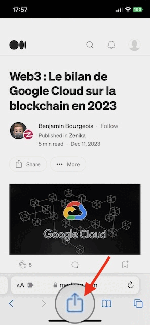

# Pochurl

Generate a RSS feed with the links I want to read later.

## Deployment:

```shell
firebase deploy
```

## Use

### Add

To add entries to your RSS feed, use your functions.

```shell
curl --request POST \
     --url https://add-entry-<SOMETHING>.app/ \
     --header 'Content-Type: application/json' \
     --data '{
         "link": "<THE LINK TO READ LATER>"
     }'
```

[See other examples](###Examples).

### Read

Your RSS feed is available at your function's address (like `https://get-entries-<SOMETHING>.app`).

You can use your favorite RSS feed reader ([NetNewsWire](https://github.com/Ranchero-Software/NetNewsWire) 🥸 or any other) to read your _"Read it Later"_ links.

### Examples

#### Apple Shortcut

You can use the adding query in several ways.

For example, with Apple Shortcuts (like this one: [Pochurl Shortcut](https://www.icloud.com/shortcuts/d89744ccfe504ef8b504aae3b27b6aa0)) you can simply add a link to your feed from the share menu.


